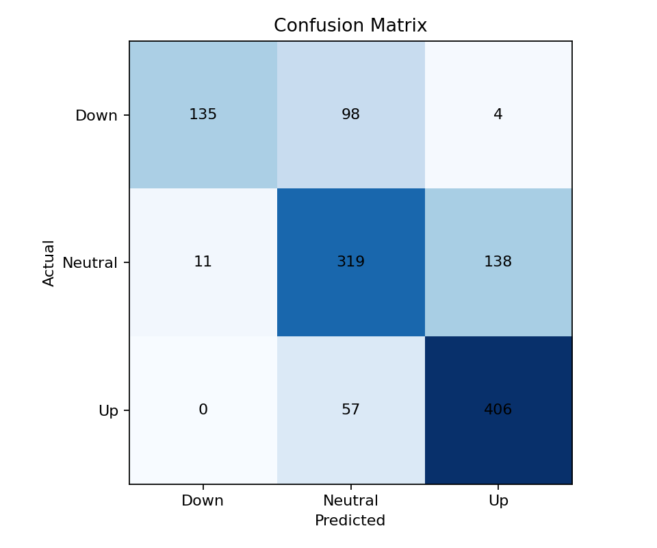
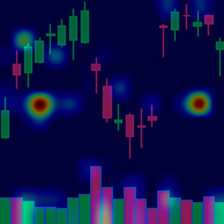
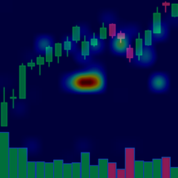

# Candlestick Trend Prediction with Vision Transformers

This project predicts short-term stock trend direction from candlestick chart images using a hybrid deep learning model. A Vision Transformer (ViT) encodes the chart image, and the resulting embedding is combined with three technical features:

- `RSI`
- `MACD`
- `trend_score`

The classifier predicts one of three classes:

- `Down`
- `Neutral`
- `Up`

The repository includes the model definition, a training notebook, an evaluation/XAI script, a simple prediction script, a prepared metadata file, and a trained checkpoint.

## Project Highlights

- Vision-based candlestick classification with a `vit_small_patch16_224` backbone
- Multimodal setup combining chart images and technical indicators
- Evaluation pipeline with metrics, confusion matrix, prediction export, and Grad-CAM style visualizations
- Basic comparison against classical candlestick patterns such as Doji, Hammer, and Engulfing patterns

## Repository Structure

```text
.
|-- analyze_model.py              # Evaluation, pattern analysis, Grad-CAM overlays, markdown report
|-- best_model.pth                # Trained checkpoint
|-- model.py                      # ViT + feature fusion model
|-- predict.py                    # Single-sample prediction example
|-- prepare_dataset_folders.py    # Organize dataset metadata into train/validation/test structure
|-- train-2-vit.ipynb             # Training notebook
|-- data/
|   `-- labeled_dataset.csv       # Dataset metadata used by the scripts
|-- organized_dataset/
|   `-- manifest.csv              # Generated manifest for organized folder layout
`-- outputs_new_test/
    |-- evaluation_metrics.json
    |-- confusion_matrix.png
    |-- pattern_comparison.json
    |-- predictions.csv
    |-- report.md
    `-- xai/                      # Example explanation overlays
```

## Model Architecture

The model defined in [model.py](model.py) uses:

- `timm` Vision Transformer backbone: `vit_small_patch16_224`
- ViT embedding size: `384`
- Additional numerical features: `RSI`, `MACD`, `trend_score`
- Fusion head:
  - `Linear(384 + 3, 128)`
  - `ReLU`
  - `Dropout`
  - `Linear(128, 3)`

At inference time, the chart image and technical indicators are fed together to produce the final class logits.

## Dataset Format

The project expects a CSV similar to [data/labeled_dataset.csv](data/labeled_dataset.csv) with columns like:

- `image_path`
- `ticker`
- `date`
- `label`
- `label_id`
- `RSI`
- `MACD`
- `MACD_signal`
- `forward_return`
- `trend_score`
- `split`

Current label mapping:

- `0 = Down`
- `1 = Neutral`
- `2 = Up`

From the training notebook, the working split was time-based:

- Train: `2022-02-01` to `2024-10-15`
- Validation: `2024-10-16` to `2025-07-28`
- Test: `2025-07-29` to `2025-12-15`

## Results

The checked-in evaluation in `outputs_new_test/` reports:

- Accuracy: `0.7363`
- Macro F1: `0.7285`

Per-class metrics:

| Class | Precision | Recall | F1 | Support |
|---|---:|---:|---:|---:|
| Down | 0.9247 | 0.5696 | 0.7050 | 237 |
| Neutral | 0.6730 | 0.6816 | 0.6773 | 468 |
| Up | 0.7409 | 0.8769 | 0.8032 | 463 |

Confusion matrix order: `Down, Neutral, Up`



The accompanying report also compares the model against a small set of hand-crafted candlestick rules:

- Rows with any classical pattern: `258`
- Classical signal agreement with ground truth: `0.3527`
- Classical signal agreement with model prediction: `0.3682`

This is a useful takeaway from the project: the learned model appears to capture richer chart structure than the limited rule-based baseline.

## Explainability

`analyze_model.py` generates Grad-CAM style overlays from the final transformer block to show which chart regions influenced the decision most strongly.

Example overlays are available in `outputs_new_test/xai/`.

| Sample | Preview |
|---|---|
| AAPL |  |
| NFLX |  |

## Setup

Python `3.10+` is recommended.

Install the main dependencies:

```bash
pip install torch torchvision timm pillow matplotlib numpy pandas scikit-learn
```

If you want to work directly with the notebook, install Jupyter as well:

```bash
pip install notebook
```

## How To Run

### 1. Train

Training currently lives in the notebook:

```text
train-2-vit.ipynb
```

The notebook:

- loads the CSV metadata
- applies a time-based split
- builds the ViT + feature-fusion model
- trains with AdamW, label smoothing, gradient clipping, and early stopping
- saves the best checkpoint

### 2. Evaluate and Generate Reports

Run:

```bash
python analyze_model.py --csv data/labeled_dataset.csv --checkpoint best_model.pth --output-dir outputs
```

This produces:

- evaluation metrics JSON
- confusion matrix image
- CSV predictions
- classical pattern comparison summary
- XAI overlays
- markdown report

Note: some default paths inside the current scripts still point to local Windows directories from development. If you are running this on another machine, update the defaults or pass explicit arguments.

### 3. Organize Dataset Folders

To generate an organized manifest:

```bash
python prepare_dataset_folders.py --csv data/labeled_dataset.csv --output-dir organized_dataset
```

To also copy files into train/validation/test class folders:

```bash
python prepare_dataset_folders.py --csv data/labeled_dataset.csv --output-dir organized_dataset --copy
```

### 4. Run a Single Prediction

`predict.py` shows the minimal inference flow:

```bash
python predict.py
```

Before running it, update:

- the image path
- the technical feature values
- any local checkpoint path assumptions if needed

## Current Limitations

- Some script defaults use hardcoded Windows paths from the original training environment.
- Training is notebook-based rather than packaged as a reusable CLI script.
- The repo does not yet include a pinned `requirements.txt`.
- The included `best_model.pth` is large, which makes the repository heavier to clone.

## Suggested Next Improvements

- Convert notebook training into `train.py`
- Add `requirements.txt` or `environment.yml`
- Add configurable path handling across all scripts
- Add better experiment tracking and checkpoint metadata
- Benchmark against more classical and sequence-based baselines

## Summary

This repository demonstrates a practical multimodal approach to candlestick-based market trend prediction. Instead of relying only on textbook candlestick rules, it uses a Vision Transformer to learn visual chart structure directly and combines that with technical indicators for stronger classification performance.
